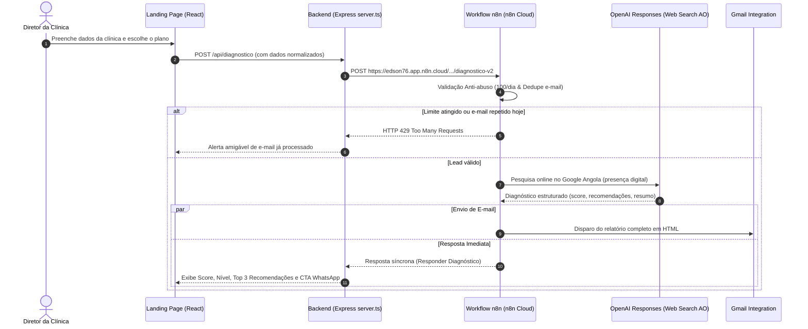

# 🏥 ClínicasDigitais — Transformação Digital para Clínicas Privadas em Angola

[](https://www.typescriptlang.org/)
[](https://reactjs.org/)
[](https://vitejs.dev/)
[](https://expressjs.com/)
[](https://tailwindcss.com/)
[](https://n8n.io/)

Landing page institucional de alta conversão desenvolvida para promover serviços de transformação digital, criação de websites de autoridade e automação inteligente para **clínicas médicas e odontológicas privadas em Angola**.

Conta com um **motor de diagnóstico em tempo real** integrado a um workflow automatizado no **n8n**, com inteligência artificial e pesquisa na web em tempo real (OpenAI Responses API com Web Search focado em Angola - AO), envio de relatório detalhado em HTML por Gmail e proteção anti-abuso.

---

## 🌟 Principais Funcionalidades

- **Diagnóstico Estratégico em Tempo Real:**
  - Formulário dinâmico com seleção de especialidade, província/cidade, website e plano pretendido.
  - Integração síncrona com workflow do n8n para pesquisa real no Google Angola.
  - Devolução imediata na tela do **Score de Maturidade (0 a 10)**, **Nível de Maturidade** (*Inicial*, *Intermediário*, *Avançado*), **Top 3 Recomendações Estratégicas** e **Estimativa de Impacto**.
- **Automação de E-mail (Gmail via n8n):**
  - Envio automático do relatório diagnóstico completo formatado em HTML profissional diretamente para a caixa de entrada do responsável da clínica.
- **Sistema Anti-Abuso & Deduplicação de Leads:**
  - Contador diário com limite de segurança de até 100 diagnósticos/dia via Data Table `cd_diagnostico_leads`.
  - Deduplicação por e-mail no mesmo dia (evita envios repetidos e responde HTTP 429 com aviso amigável ao utilizador).
  - Registo automático de IP, data, plano e dados da clínica.
- **Conversão Direta para WhatsApp:**
  - Botões de chamada para ação (CTA) integrados com mensagem personalizada pré-preenchida com o nome da clínica, responsável, especialidade e diagnóstico.
- **Apresentação dos Planos de Transformação:**
  - **Secretária Digital Start:** Presença digital essencial, website institucional e e-mail profissional.
  - **Secretária Digital Pro:** SEO Local no Google Angola, landing pages especializadas e triagem no WhatsApp.
  - **Secretária Digital Elite:** Atendimento 24/7 com Inteligência Artificial no WhatsApp, captação ativa e automação total de agendamentos.
- **Páginas e Modais Institucionais:**
  - Seções de Autoridade Técnica (Mario Cazombo e Filhos).
  - Políticas de Privacidade e Termos de Uso em conformidade com a legislação angolana e boas práticas de proteção de dados.
  - FAQ com respostas para as principais dúvidas de diretores clínicos e gestores.

---

## 🛠️ Stack Tecnológica

- **Frontend:** [React 19](https://react.dev/), [TypeScript](https://www.typescriptlang.org/), [Tailwind CSS](https://tailwindcss.com/), [Framer Motion](https://www.framer.com/motion/), [Lucide React](https://lucide.dev/).
- **Backend / BFF:** [Node.js](https://nodejs.org/), [Express 5](https://expressjs.com/), [tsx](https://github.com/privatenumber/tsx), [esbuild](https://esbuild.github.io/).
- **Automação & IA:** [n8n Cloud](https://n8n.io/), OpenAI Responses API com Web Search em tempo real (Angola - AO), Google Gemini API (motor de contingência).
- **Notificações:** Gmail Integration via nó n8n.

---

## 📁 Estrutura do Projeto

```text
├── components/
│   ├── Authority.tsx          # Apresentação do Diretor Técnico e equipe
│   ├── DiagnosticForm.tsx     # Formulário de diagnóstico com motor n8n & IA
│   ├── FAQ.tsx                # Perguntas frequentes
│   ├── FinalCTA.tsx           # Chamada final para ação
│   ├── Footer.tsx             # Rodapé com links e contatos
│   ├── Hero.tsx               # Seção principal de apresentação e proposta de valor
│   ├── Icons.tsx              # Componentes de ícones auxiliares
│   ├── Plans.tsx              # Planos Start, Pro e Elite
│   ├── PrivacyPolicy.tsx      # Política de privacidade
│   ├── Problems.tsx           # Dores e problemas comuns das clínicas
│   ├── Solution.tsx           # Apresentação da solução integrada
│   ├── TargetAudience.tsx     # Para quem é indicado
│   ├── TermsOfUse.tsx         # Termos de uso
│   ├── WhyChooseUs.tsx        # Diferenciais competitivos
│   └── WhyItWorks.tsx         # Metodologia e funcionamento
├── server.ts                  # Servidor Express, rotas da API e proxy n8n
├── index.html                 # Ponto de entrada HTML com meta tags SEO
├── index.tsx                  # Ponto de entrada React
├── App.tsx                    # Componente raiz da aplicação
├── package.json               # Dependências e scripts do projeto
├── vite.config.ts             # Configuração do Vite
├── tsconfig.json              # Configurações do TypeScript
├── .env.example               # Modelo de variáveis de ambiente
└── README.md                  # Documentação do repositório
```

---

## 🚀 Como Executar o Projeto Localmente

### 1. Pré-requisitos
- [Node.js](https://nodejs.org/) versão 18 ou superior.
- Gestor de pacotes `npm` (incluso no Node.js).

### 2. Clonar o Repositório
```bash
git clone https://github.com/SEU-USUARIO/clinicas-digitais.git
cd clinicas-digitais
```

### 3. Instalar as Dependências
```bash
npm install
```

### 4. Configurar as Variáveis de Ambiente
Crie um arquivo `.env` na raiz do projeto com base no `.env.example`:

```bash
cp .env.example .env
```

Edite o arquivo `.env`:
```env
# Chave da API Gemini (opcional, usada como fallback de contingência)
GEMINI_API_KEY=sua_chave_gemini_aqui

# URL do Webhook de Produção do n8n
N8N_WEBHOOK_URL=https://edson76.app.n8n.cloud/webhook/clinicas-digitais/diagnostico-v2
```

### 5. Iniciar o Servidor de Desenvolvimento
```bash
npm run dev
```

Acesse a aplicação no navegador em: **`http://localhost:3000`**.

---

## ⚙️ Scripts Disponíveis

- `npm run dev`: Inicia o servidor Express com suporte a TypeScript em tempo real via `tsx` na porta 3000.
- `npm run build`: Compila os assets estáticos com Vite e empacota o servidor Node.js para produção em `dist/server.cjs` via `esbuild`.
- `npm start`: Executa o servidor de produção compilado em `dist/server.cjs`.
- `npm run preview`: Visualiza o build de produção localmente via Vite.

---

## 🔗 Fluxo de Execução do Diagnóstico (n8n + IA)



---

## 🚢 Deploy em Produção

O projeto foi estruturado no padrão Full-Stack (Express + Vite), pronto para deploy em:

- **Google Cloud Run / Docker:** Utiliza porta padrão `3000` e comando `npm start`.
- **Render / Railway / Heroku:**
  - **Build Command:** `npm run build`
  - **Start Command:** `npm start`
- **Vercel / Netlify:** Suporta separação de frontend estático (`dist/`) e funções serverless para as rotas `/api/*`.

---

## 📄 Licença

Este projeto é de propriedade de **Mario Cazombo e Filhos / ClínicasDigitais**. Todos os direitos reservados.
Proibida a reprodução ou cópia sem autorização prévia.
